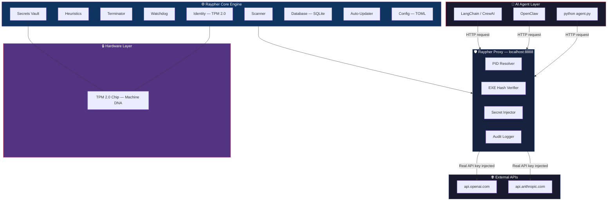

<](https://github.com/kidigapeet/Raypher-core/releases)
[](https://www.rust-lang.org)
[](LICENSE)
[]()

**Silicon-native sovereign security for autonomous AI agents.**
**No other platform on earth connects hardware identity to kernel enforcement to enterprise governance in one binary.**

[Getting Started](#-getting-started) · [Features](#-the-10-features) · [CLI Reference](#-cli-reference) · [Progress](#-completion-status)

</div>

---

## 🧬 What Is Raypher?

Raypher is an **invisible, unkillable security service** that monitors, controls, and governs autonomous AI agents at the hardware and OS level. It runs as a background system service, binds its identity to the physical **TPM 2.0** chip, and sits between AI agents and the outside world — intercepting, auditing, and enforcing policy on every action.

> 💡 **Think of it as:** An operating system layer between your AI agents and everything they touch — files, networks, APIs, databases. The agent never sees Raypher. Raypher sees everything.

### The Problem

| Without Raypher | With Raypher |
|:---|:---|
| API keys hardcoded in `.env` files | 🔐 Keys sealed in TPM silicon — never on disk |
| No visibility into what agents are doing | 👁️ Every action audited to immutable ledger |
| Agents can access any file, any server | 🚧 Kernel-level policies block dangerous actions |
| No way to kill a rogue agent instantly | ⚡ Panic Protocol: sub-millisecond recursive kill |
| Updates require manual intervention | 🔄 Self-updating with 5-minute auto-rollback |

---

## 🏗️ Architecture



---

## ✨ The 10 Features

Raypher is built in **10 phases**, each adding a layer of security. Phases 1 & 2 are complete.

### 🟢 Phase 1 — The Foundation *(Silicon Sentinel)* `COMPLETE`

> Build the engine that sees, identifies, judges, and kills rogue AI processes.

| Module | File | What It Does |
|:---|:---|:---|
| 🔍 **Scanner** | `scanner.rs` | Enumerates every running process with risk scoring |
| 🧠 **Heuristics** | `heuristics.rs` | 3-level AI detection: binary name → arguments → environment |
| 🧬 **Identity** | `identity.rs` | Reads TPM 2.0 Endorsement Key → SHA-256 machine fingerprint |
| ☠️ **Terminator** | `terminator.rs` | Recursive process tree kill (children-first, bottom-up) |
| 🛑 **Safety** | `safety.rs` | Hard whitelist protects `csrss.exe`, `systemd`, etc. |
| 🚨 **Panic** | `panic.rs` | Dead Man's Switch: emergency kill with forensic snapshot |
| 🗼 **Watchtower** | `watchtower.rs` | Efficient monitoring loop (< 1% CPU) with graceful Ctrl+C |

<details>
<summary><b>🔎 Risk Scoring Detail</b></summary>

```
Level 1 — Binary Name Match
   ollama, uvicorn, torchserve, llama.cpp → MEDIUM

Level 2 — Argument Analysis
   python + langchain/openai/autogpt/crewai → HIGH

Level 3 — Environment Inspection
   OPENAI_API_KEY, ANTHROPIC_API_KEY present → CRITICAL
```

</details>

---

### 🟢 Phase 2 — The Ghost Protocol *(Invisibility & Persistence)* `COMPLETE`

> Transform the CLI into an invisible, unkillable System Service with self-update and API key management.

| Module | File | What It Does |
|:---|:---|:---|
| 👻 **Service** | `service.rs` | Windows Service (SCM) running as `LocalSystem` |
| 🔌 **Proxy** | `proxy.rs` | Localhost proxy on `:8888` with PID verification + key injection |
| 🔑 **Secrets** | `secrets.rs` | TPM-sealed API key storage (seal/unseal/allow commands) |
| 🗄️ **Database** | `database.rs` | SQLite audit ledger: events, secrets, scan results |
| 🔄 **Updater** | `updater.rs` | Auto-update from GitHub Releases + 5-min rollback safety |
| 🐕 **Watchdog** | `watchdog.rs` | OS-level crash recovery (restart on every failure) |
| ⚙️ **Config** | `config.rs` | TOML configuration with sensible defaults |
| 📦 **Installer** | `wix/main.wxs` | Windows MSI installer via WiX Toolset |
| 🚀 **CI/CD** | `release.yml` | GitHub Actions automated cross-platform builds |

<details>
<summary><b>🔐 The Vault Flow — How API Keys Stay Safe</b></summary>

```
1. Agent sends request → localhost:8888
2. Raypher resolves the calling PID from TCP socket
3. Scans PID → gets exe path → computes SHA-256 hash
4. Checks hash against Allow List in database
   ✅ Match  → Decrypts real API key from TPM vault
             → Injects into Authorization header
             → Forwards to api.openai.com
   ❌ No match → Connection dropped. Agent sees "Connection Reset"
5. Everything logged to audit ledger
```

</details>

<details>
<summary><b>🔄 Auto-Rollback Safety Net</b></summary>

```
Update applied → marker file written with timestamp
  └─ Service restarts within 5 minutes?
     ├─ YES → New binary is bad → Restore .old binary → Rollback!
     └─ NO  → Update is stable → Clean up .old and .failed binaries
```

</details>

---

### 🔴 Phase 3 — The Local Guard *(Kernel-Level Enforcement)* `PLANNED`

> eBPF probes (Linux) + WFP filters (Windows) that block dangerous syscalls *before* they execute.

| Attack | Hook | Outcome |
|:---|:---|:---|
| Agent deletes `production.db` | `sys_unlink` | ❌ File deletion blocked |
| Agent spawns `/bin/bash` piped to network | `sys_execve` + `sys_socket` | ❌ Process killed before connection opens |
| Agent uploads customer data to `pastebin.com` | `sys_connect` | ❌ Connection reset, data never leaves |

---

### 🔴 Phase 4 — The Network Proxy *(Air Traffic Controller)* `PLANNED`

> Transparent MITM with TLS termination. Zero code changes from the developer.

| Defense Layer | What It Blocks |
|:---|:---|
| 🛡️ **SSRF Prevention** | All private IP ranges (`10.0.0.0/8`, `169.254.x.x`) |
| 🏰 **Domain Whitelisting** | Only whitelisted domains pass (e.g., `api.openai.com`) |
| 🔍 **DLP Scanning** | Credit cards, SSNs, API keys detected via regex |
| 💰 **Budget Enforcement** | Daily cost cap per agent (e.g., $50/day) |

---

### 🔴 Phase 5 — The Policy Engine *(The Constitution)* `PLANNED`

> Policy as Code. YAML/JSON rules version-controlled in Git.

**Four Pillars:** Operational (file/process access) · Financial (cost limits) · Network (domain control) · Temporal (time-fencing)

**Hierarchy:** Global (CISO) → Team (Manager) → Local (Developer). Most restrictive wins.

---

### 🔴 Phase 6 — Shadow AI Discovery *(The Sonar)* `PLANNED`

> Find every AI model, agent, and vector database running in the dark.

**Layers:** Process scanning · Port monitoring (11434, 8000, 6333) · Network inspection · mDNS discovery

---

### 🔴 Phase 7 — Data Loss Prevention *(The Content Filter)* `PLANNED`

> Automatic redaction of secrets and PII before data leaves the device.

**Engine:** High-speed Rust regex + contextual NER + Microsoft Presidio integration

**Compliance:** GDPR · HIPAA · PCI-DSS

---

### 🔴 Phase 8 — The Trust Score *(FICO Score for AI)* `PLANNED`

> Dynamic reputation system (0-1000) governing agent privileges.

| Score | Status | Privileges |
|:---|:---|:---|
| **900+** | 🟢 Autonomous | Deploy code, move money |
| **700-899** | 🟡 Probationary | Needs human approval for sensitive actions |
| **< 500** | 🔴 Restricted | Read-only, sandboxed |

**Algorithm:** Behavioral History (60%) + Identity & Provenance (20%) + Community Intelligence (20%)

---

### 🔴 Phase 9 — The Audit Ledger *(The Flight Recorder)* `PLANNED`

> Cryptographically signed, immutable record. Legally admissible chain of custody.

**Technology:** SHA-256 Merkle hash chain (Blockchain-Lite). Each entry links to the previous. Broken chain → `CORRUPTED` flag → CISO alert.

**Storage:** Local encrypted buffer (24h) → Cloud sync (30 days) → Cold archive (7 years)

---

### 🔴 Phase 10 — The Unified Dashboard *(God Mode)* `PLANNED`

> Single pane of glass for enterprise AI governance.

**Views:** API Watchtower (live connections) · Database X-Ray (data flow visualization) · Trust Leaderboard (risk ranking)

**Controls:** Global Policy Push (< 2 sec) · Global Freeze ("Panic Center") · SOC2/ISO 27001 Report Generator

---

## 💻 CLI Reference

```
raypher-core — Silicon-native sovereign security for AI agents

COMMANDS:
  scan       🔍  Scan all processes and score AI risk levels
  monitor    🗼  Run the Watchtower continuous monitoring loop
  seal       🔐  Encrypt and store an API key in the TPM vault
  unseal     🔓  Decrypt and display a stored key (same hardware only)
  allow      ✅  Add a binary's SHA-256 hash to the proxy allow list
  proxy      🔌  Start the localhost API proxy on 127.0.0.1:8888
  kill       ☠️   Kill a process and its entire child tree
  panic      🚨  Emergency shutdown with forensic snapshot
  identity   🧬  Display the machine's TPM fingerprint
  update     🔄  Check for binary updates from GitHub Releases
  install    📦  Install as a Windows Service
  service    👻  Run in Windows Service mode (SCM only)
  query      🗄️  Query the local database
  status     📊  Display service health
```

---

## 🚀 Getting Started

### Quick Install (Windows)

```powershell
# 1. Build from source
cargo build --release

# 2. Seal your OpenAI API key into the TPM vault
.\target\release\raypher-core.exe seal --provider openai

# 3. Allow your Python runtime through the proxy
.\target\release\raypher-core.exe allow --exe-path "C:\Python312\python.exe"

# 4. Start the invisible proxy
.\target\release\raypher-core.exe proxy

# 5. Point your agent to localhost:8888 — Raypher handles the rest
```

### Quick Install (Linux)

```bash
curl -fsSL https://github.com/kidigapeet/Raypher-core/releases/latest/download/raypher-linux-amd64 \
  -o /usr/local/bin/raypher && chmod +x /usr/local/bin/raypher
sudo raypher install
```

### Build From Source

```bash
git clone https://github.com/kidigapeet/Raypher-core.git
cd Raypher-core
cargo build --release
```

---

## 🧩 Source Files

```
src/
├── main.rs          ← CLI + Windows Service dispatcher (18 KB)
├── scanner.rs       ← Process discovery via sysinfo (9 KB)
├── heuristics.rs    ← 3-level AI risk scoring (9 KB)
├── identity.rs      ← TPM 2.0 machine fingerprint (6 KB)
├── terminator.rs    ← Recursive process tree kill (4 KB)
├── killer.rs        ← Kill chain orchestration (6 KB)
├── safety.rs        ← Critical process whitelist (1 KB)
├── panic.rs         ← Dead Man's Switch (1 KB)
├── watchtower.rs    ← Monitoring loop (5 KB)
├── proxy.rs         ← Localhost API proxy (15 KB)
├── secrets.rs       ← TPM-sealed secret storage (6 KB)
├── database.rs      ← SQLite audit ledger (11 KB)
├── service.rs       ← Windows Service (SCM) (14 KB)
├── watchdog.rs      ← Crash recovery (5 KB)
├── updater.rs       ← Auto-update + rollback (11 KB)
├── config.rs        ← TOML configuration (9 KB)
└── monitor.rs       ← Real-time display (5 KB)

17 files · ~3,900 lines of Rust · single native binary
```

---

## 📊 Completion Status

```
Phase 1   ████████████████████  100%   The Foundation
Phase 2   ████████████████████  100%   The Ghost Protocol
Phase 3   ░░░░░░░░░░░░░░░░░░░░    0%   The Local Guard
Phase 4   ░░░░░░░░░░░░░░░░░░░░    0%   The Network Proxy
Phase 5   ░░░░░░░░░░░░░░░░░░░░    0%   The Policy Engine
Phase 6   ░░░░░░░░░░░░░░░░░░░░    0%   Shadow AI Discovery
Phase 7   ░░░░░░░░░░░░░░░░░░░░    0%   Data Loss Prevention
Phase 8   ░░░░░░░░░░░░░░░░░░░░    0%   The Trust Score
Phase 9   ░░░░░░░░░░░░░░░░░░░░    0%   The Audit Ledger
Phase 10  ░░░░░░░░░░░░░░░░░░░░    0%   The Dashboard
──────────────────────────────────────
Overall   ████░░░░░░░░░░░░░░░░   20%   2 of 10 phases
```

<details>
<summary><b>📋 Detailed Checklist — Phase 1 (13/13 ✅)</b></summary>

- [x] Process scanner with `ProcessData`, `DataConfidence`, `RiskLevel` enums
- [x] Graceful fallback when OS denies access to process details
- [x] 3-level heuristic risk engine: binary name → arguments → environment
- [x] TPM 2.0 identity: EK reading, SHA-256 machine fingerprint
- [x] Recursive process tree kill (bottom-up, children-first)
- [x] Critical process safety whitelist
- [x] Panic Protocol: emergency shutdown + forensic snapshot
- [x] Watchtower: efficient monitoring loop (< 1% CPU)
- [x] CLI entry point with `clap` subcommands
- [x] Structured JSON output via `serde_json`
- [x] `tracing` structured logging
- [x] Cross-compilation support via `cross` crate
- [x] Release profile: LTO, stripped, single codegen unit

</details>

<details>
<summary><b>📋 Detailed Checklist — Phase 2 (15/15 ✅)</b></summary>

- [x] Windows Service implementation with SCM handshake
- [x] Service runs as `LocalSystem` (higher than Admin)
- [x] Linux daemon systemd unit file
- [x] Localhost proxy on `:8888` with PID resolution + EXE hash verification
- [x] Secret injection: TPM-decrypted API key into `Authorization` header
- [x] Secret Manager: `seal`, `unseal`, `allow` commands
- [x] SQLite database with events, secrets, allowed_exes, scan_results tables
- [x] Audit event logging: `AUTO_UPDATE`, `UPDATE_ERROR`, etc.
- [x] Windows MSI installer via WiX Toolset
- [x] GitHub Actions CI/CD pipeline
- [x] Auto-updater from GitHub Releases with binary swap
- [x] 5-minute auto-rollback safety net with marker file system
- [x] Watchdog: OS-level service recovery on crash
- [x] TOML configuration system with defaults
- [x] All update events logged to DB audit ledger

</details>

<details>
<summary><b>📋 Future Phases (3-10) — Full Checklist</b></summary>

**Phase 3 — The Local Guard**
- [ ] eBPF probes: `sys_execve`, `sys_connect`, `sys_unlink`, `sys_open`
- [ ] WFP filters functional on Windows
- [ ] Identity-aware interception (TPM → kernel enforcement)
- [ ] Policy checks: ALLOW/DENY verdicts
- [ ] No false positives on system processes

**Phase 4 — The Network Proxy**
- [ ] Local Root CA certificate generation + OS Trust Store install
- [ ] Transparent TLS termination and re-encryption
- [ ] SSRF blocking for private IP ranges
- [ ] Domain whitelisting
- [ ] Regex-based DLP on payload bodies
- [ ] Budget tracking per agent

**Phase 5 — The Policy Engine**
- [ ] YAML/JSON policy file format
- [ ] Operational, Financial, Network, Temporal pillars
- [ ] Cascading hierarchy (Most Restrictive Wins)
- [ ] Dynamic Trust-Based policies
- [ ] Policy hot-reload
- [ ] Global Push in < 2 seconds

**Phase 6 — Shadow AI Discovery**
- [ ] Process + DLL/library scanning
- [ ] Port monitoring (11434, 8000, 6333, 5000)
- [ ] Network inspection for LLM patterns
- [ ] mDNS discovery for neighboring AI services

**Phase 7 — Data Loss Prevention**
- [ ] High-speed regex engine (API keys, CC, SSN, etc.)
- [ ] Local NER model for contextual PII
- [ ] Presidio integration
- [ ] Redact mode + Block mode

**Phase 8 — The Trust Score**
- [ ] Real-time score API (0-1000)
- [ ] 3-pillar algorithm (Behavioral/Identity/Community)
- [ ] Score decay over inactivity
- [ ] CVE vulnerability alerts

**Phase 9 — The Audit Ledger**
- [ ] SHA-256 Merkle hash chain
- [ ] Tamper detection (CORRUPTED flag)
- [ ] Local buffer → Cloud sync → Cold storage
- [ ] TPM-signed entries

**Phase 10 — The Dashboard**
- [ ] API Watchtower (live streaming)
- [ ] Database X-Ray (data flow visualization)
- [ ] Trust Score Leaderboard
- [ ] Global Policy Push + Global Freeze
- [ ] SOC2/ISO 27001 report generator

</details>

---

## 🧰 Tech Stack

| | Technology | Purpose |
|:---|:---|:---|
| 🦀 | **Rust** | Memory-safe, zero-cost abstractions |
| 🔐 | **Windows CNG / tss-esapi** | TPM 2.0 hardware identity |
| ⚡ | **Tokio + Axum** | Async runtime + HTTP proxy |
| 🌐 | **Reqwest (rustls)** | HTTPS forwarding (no OpenSSL) |
| 🗄️ | **Rusqlite** | Embedded SQLite database |
| 📦 | **self_update** | Auto-update from GitHub Releases |
| 🖥️ | **windows-service** | Windows SCM integration |
| ⚙️ | **Clap** | CLI framework |
| 📝 | **Tracing** | Structured logging |
| 🔧 | **Serde + TOML** | Serialization + configuration |

---

<div align="center">

**Built by Raypher Labs · Powered by Rust · Anchored to Silicon**

*Last updated: 2026-02-14*

</div>
]]>
