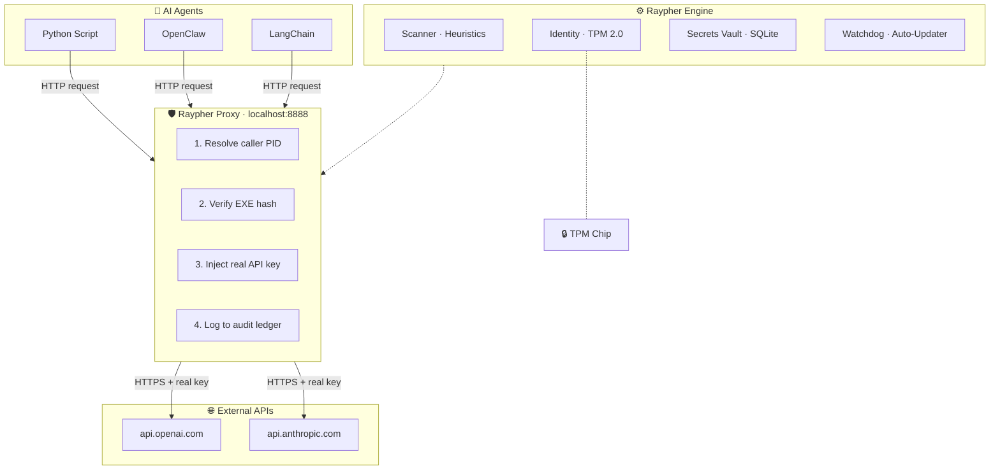

<](https://github.com/kidigapeet/Raypher-core/releases)
&nbsp;&nbsp;
[](https://www.rust-lang.org)
&nbsp;&nbsp;
[](LICENSE)
&nbsp;&nbsp;
[]()

<br>

*Silicon-native sovereign security for autonomous AI agents.*
*Anchors identity to hardware. Intercepts API keys at the proxy layer. Kills rogue agents in milliseconds.*

<br>

[Getting Started](#-getting-started)
&nbsp;&nbsp;·&nbsp;&nbsp;
[Features](#-feature-overview)
&nbsp;&nbsp;·&nbsp;&nbsp;
[CLI Reference](#-cli-reference)
&nbsp;&nbsp;·&nbsp;&nbsp;
[Progress](#-where-we-are)

<br>

</div>

---

<br>

## 🧬 What Is Raypher?

Raypher is an **invisible, unkillable security service** that sits between your AI agents and everything they touch — files, networks, APIs, databases.

It runs as a background system service, binds its identity to the physical **TPM 2.0** chip on your machine, and enforces policy on every action an AI agent takes.

**The agent never sees Raypher. Raypher sees everything.**

<br>

### The Problem Raypher Solves

<table>
<tr>
<th width="50%">❌ Without Raypher</th>
<th width="50%">✅ With Raypher</th>
</tr>
<tr>
<td>API keys hardcoded in <code>.env</code> files</td>
<td>Keys sealed in TPM silicon — never exist on disk in plaintext</td>
</tr>
<tr>
<td>No visibility into what agents are doing</td>
<td>Every action audited to an immutable database ledger</td>
</tr>
<tr>
<td>Agents can access any file, any server</td>
<td>Proxy verifies caller identity before forwarding requests</td>
</tr>
<tr>
<td>No way to kill a rogue agent instantly</td>
<td>Panic Protocol: recursive process tree kill in milliseconds</td>
</tr>
<tr>
<td>Updates require manual intervention</td>
<td>Self-updating binary with 5-minute auto-rollback safety</td>
</tr>
</table>

<br>

---

<br>

## 🏗️ How It Works



<br>

> **The flow:** Agent sends request to `localhost:8888` → Raypher identifies the calling process by PID → verifies its binary hash against the allow list → decrypts the real API key from the TPM vault → injects it into the request header → forwards to the real API → logs everything to the audit ledger.
>
> **The agent never touches the real API key.**

<br>

---

<br>

## ✨ Feature Overview

Raypher is built in **10 phases**. Each phase adds a layer of security.

<br>

### 🟢 Phase 1 — The Foundation *(Complete)*

> The engine that sees, identifies, judges, and kills rogue AI processes.

<br>

**🔍 Process Scanner** — Enumerates every running process with full metadata: PID, name, command-line args, memory usage, CPU, parent PID, exe path. Gracefully degrades when the OS denies access (marks as "Low Confidence" instead of crashing).

<br>

**🧠 Heuristic Risk Engine** — Three escalating levels of AI detection:

- **Level 1 — Binary Name:** Matches `ollama`, `uvicorn`, `torchserve`, `llama.cpp` → Risk: **MEDIUM**
- **Level 2 — Arguments:** Matches `python` running `langchain`, `openai`, `autogpt`, `crewai` → Risk: **HIGH**
- **Level 3 — Environment:** Detects `OPENAI_API_KEY`, `ANTHROPIC_API_KEY` in env vars → Risk: **CRITICAL**

<br>

**🧬 Silicon-Bound Identity** — Reads the TPM 2.0 Endorsement Key and computes a SHA-256 machine fingerprint. This fingerprint is persistent across reboots and unique per physical device. If someone steals the database file and tries to use it on another machine — decryption fails. The key is burned into the silicon.

<br>

**☠️ Process Terminator** — Recursive process tree kill. Discovers all child and grandchild processes, then kills them **bottom-up** (leaves first, trunk last) to prevent orphan zombies. Includes a safety whitelist that protects critical system processes like `csrss.exe`, `systemd`, and `svchost.exe`.

<br>

**🚨 Panic Protocol** — The Dead Man's Switch. Emergency kill with forensic snapshot. Captures the last 60 seconds of activity, logs what the agent was doing, and writes an immutable audit entry.

<br>

**🗼 Watchtower** — Efficient continuous monitoring loop. Initializes the system scanner once, then uses incremental `refresh_processes()` on a 2-second interval. Result: **< 1% CPU usage**. Handles `Ctrl+C` gracefully via an `AtomicBool` shutdown flag.

<br>

---

<br>

### 🟢 Phase 2 — The Ghost Protocol *(Complete)*

> Transforms the CLI into an invisible, unkillable System Service with self-update and API key management.

<br>

**👻 Windows Service** — Single binary with two personalities. In CLI mode, it prints to the console and exits. In Service mode, it talks to the Windows Service Control Manager (SCM), runs as `LocalSystem` (higher privilege than Admin), and has no console window. Starts automatically on boot.

<br>

**🔌 Localhost Proxy** — Axum HTTP server on `127.0.0.1:8888`. Accepts OpenAI-compatible requests at `/v1/chat/completions`. Resolves the calling PID from the TCP socket, verifies the caller's binary SHA-256 hash against an allow list, and injects the real API key from the TPM vault. Connection pooling via `reqwest` Keep-Alive for low latency.

<br>

**🔐 Secret Manager** — Three CLI commands:
- `seal` — Encrypts an API key with the TPM public key, stores the encrypted blob in SQLite
- `unseal` — Decrypts and displays (only works on the same physical hardware)
- `allow` — Adds a binary's SHA-256 hash to the proxy allow list

<br>

**🗄️ Audit Database** — SQLite with five tables: `machine_info`, `secrets`, `allowed_exes`, `events`, `scan_results`. Every significant action is logged with timestamp, event type, details JSON, and severity. Event types include `MACHINE_REGISTERED`, `SECRET_STORED`, `EXE_ALLOWED`, `AUTO_UPDATE`, `UPDATE_ERROR`, `PROCESS_KILLED`.

<br>

**🔄 Auto-Updater** — Checks GitHub Releases for newer versions. Downloads the new binary, renames the current exe to `.old`, swaps in the new one, and restarts the service. Includes a **5-minute rollback safety net**: if the service restarts within 5 minutes of an update, Raypher assumes the new binary is bad and automatically restores the `.old` version.

<br>

**🐕 Watchdog** — OS-level service recovery. If Raypher crashes, Windows restarts it automatically (1-second delay). Crash counter resets after 24 hours of stable operation.

<br>

**⚙️ TOML Configuration** — Loads settings from `~/.raypher/config.toml`. Falls back to compiled defaults if the file is missing. Configurable sections: Service, Proxy, Watchtower, Updater, Logging.

<br>

**📦 Installer & CI/CD** — WiX MSI installer for Windows with service registration. GitHub Actions workflow triggers on tag push, builds for Linux and Windows, and creates a GitHub Release with downloadable artifacts.

<br>

---

<br>

### 🔴 Phase 3 — The Local Guard *(Planned)*

> Kernel-level interception that blocks dangerous actions *before* they execute.

**Linux:** eBPF probes on `sys_execve`, `sys_connect`, `sys_unlink`, `sys_open`

**Windows:** WFP (Windows Filtering Platform) + Kernel Callback Drivers

| Scenario | What happens |
|:---|:---|
| Agent tries to delete `production.db` | Deletion blocked before it executes |
| Agent spawns a reverse shell | Process killed before the connection opens |
| Agent uploads customer data to `pastebin.com` | Connection reset — data never leaves the device |

<br>

---

<br>

### 🔴 Phase 4 — The Network Proxy *(Planned)*

> Transparent MITM with TLS termination. Zero code changes from the developer.

- **SSRF Prevention** — Blocks all private IP ranges (`10.0.0.0/8`, `192.168.x.x`, `169.254.x.x`)
- **Domain Whitelisting** — Only approved domains pass through
- **DLP Scanning** — Detects credit cards, SSNs, API keys via regex before they leave the device
- **Budget Enforcement** — Daily cost cap per agent (e.g., $50/day → returns `429` at limit)

<br>

---

<br>

### 🔴 Phase 5 — The Policy Engine *(Planned)*

> Policy as Code. YAML/JSON rules, version-controlled in Git.

Four pillars: **Operational** (file/process access) · **Financial** (cost limits) · **Network** (domain control) · **Temporal** (time-fencing — no agent runs at 3 AM Sunday)

Cascading hierarchy: Global (CISO) → Team (Manager) → Local (Developer). **Most restrictive wins.**

<br>

---

<br>

### 🔴 Phase 6 — Shadow AI Discovery *(Planned)*

> Find every AI model, agent, and vector database running in the dark.

Process scanning · Port monitoring (11434/Ollama, 8000/ChromaDB, 6333/Qdrant) · DLL analysis (CUDA = hidden AI) · mDNS network discovery

<br>

---

<br>

### 🔴 Phase 7 — Data Loss Prevention *(Planned)*

> Automatic redaction of secrets and PII before data leaves the device.

High-speed Rust regex + contextual NER + Microsoft Presidio integration. Compliance: **GDPR · HIPAA · PCI-DSS**.

<br>

---

<br>

### 🔴 Phase 8 — The Trust Score *(Planned)*

> Dynamic reputation system (0–1000) governing agent privileges.

| Score | Status | Privileges |
|:---|:---|:---|
| 900+ | 🟢 Autonomous | Deploy code, move money |
| 700–899 | 🟡 Probationary | Needs human approval |
| < 500 | 🔴 Restricted | Read-only, sandboxed |

Three-pillar algorithm: Behavioral History (60%) + Identity (20%) + Community Intelligence (20%).

<br>

---

<br>

### 🔴 Phase 9 — The Audit Ledger *(Planned)*

> Cryptographically signed, immutable record. Legally admissible chain of custody.

SHA-256 Merkle hash chain: each entry links to the previous. If any entry is deleted or modified, the math breaks → `CORRUPTED` flag → CISO alert.

Storage tiers: Local encrypted buffer (24h) → Cloud sync (30 days) → Cold archive (**7 years**).

<br>

---

<br>

### 🔴 Phase 10 — The Unified Dashboard *(Planned)*

> Single pane of glass for enterprise AI governance.

- **API Watchtower** — Live streaming of every active API connection with a "Kill" button
- **Database X-Ray** — Visualized data flow between agents and databases
- **Trust Leaderboard** — Agents ranked by risk score
- **Global Freeze** — Suspend all agents using a specific library in one click
- **Compliance Reports** — Auto-generated SOC2/ISO 27001 PDFs

<br>

---

<br>

## 💻 CLI Reference

```
raypher-core <COMMAND>

  scan         Scan all processes and score AI risk levels
  monitor      Run the Watchtower continuous monitoring loop
  seal         Encrypt and store an API key in the TPM vault
  unseal       Decrypt and display a stored key (same hardware only)
  allow        Add a binary's hash to the proxy allow list
  proxy        Start the localhost API proxy on 127.0.0.1:8888
  kill         Kill a process and its entire child tree
  panic        Emergency shutdown with forensic snapshot
  identity     Display the machine's TPM fingerprint
  update       Check for binary updates from GitHub Releases
  install      Install as a Windows Service
  service      Run in Windows Service mode (SCM only)
  query        Query the local database
  status       Display service health
```

<br>

---

<br>

## 🚀 Getting Started

**Build from source** (requires Rust 1.75+):

```bash
git clone https://github.com/kidigapeet/Raypher-core.git
cd Raypher-core
cargo build --release
```

**Seal your first API key:**

```powershell
.\target\release\raypher-core.exe seal --provider openai
```

**Allow your Python runtime:**

```powershell
.\target\release\raypher-core.exe allow --exe-path "C:\Python312\python.exe"
```

**Start the proxy:**

```powershell
.\target\release\raypher-core.exe proxy
```

**Point your agent to `http://localhost:8888`** — Raypher handles the rest.

<br>

---

<br>

## 🧩 Source Files

| File | Size | Purpose |
|:---|:---|:---|
| `main.rs` | 18 KB | CLI entry point + Windows Service dispatcher |
| `scanner.rs` | 9 KB | Process discovery via `sysinfo` |
| `heuristics.rs` | 9 KB | 3-level AI risk scoring engine |
| `identity.rs` | 6 KB | TPM 2.0 machine fingerprint |
| `terminator.rs` | 4 KB | Recursive process tree kill |
| `killer.rs` | 6 KB | Kill chain orchestration |
| `safety.rs` | 1 KB | Critical process whitelist |
| `panic.rs` | 1 KB | Dead Man's Switch |
| `watchtower.rs` | 5 KB | Monitoring loop |
| `proxy.rs` | 15 KB | Localhost API proxy |
| `secrets.rs` | 6 KB | TPM-sealed secret storage |
| `database.rs` | 11 KB | SQLite audit ledger |
| `service.rs` | 14 KB | Windows Service (SCM) |
| `watchdog.rs` | 5 KB | Crash recovery |
| `updater.rs` | 11 KB | Auto-update + rollback |
| `config.rs` | 9 KB | TOML configuration |
| `monitor.rs` | 5 KB | Real-time process display |

**17 files · ~3,900 lines of Rust · compiles to a single native binary**

<br>

---

<br>

## 🧰 Tech Stack

| Technology | Purpose |
|:---|:---|
| **Rust** | Memory-safe systems language |
| **Tokio + Axum** | Async runtime + HTTP proxy server |
| **Reqwest (rustls)** | HTTPS forwarding without OpenSSL |
| **Windows CNG** | TPM 2.0 hardware identity |
| **Rusqlite** | Embedded SQLite database |
| **self_update** | Auto-update from GitHub Releases |
| **windows-service** | Windows SCM integration |
| **Clap** | CLI framework |
| **Tracing** | Structured logging |
| **Serde + TOML** | Serialization + configuration |

<br>

---

<br>

## 📊 Where We Are

| Phase | Name | Status |
|:---:|:---|:---:|
| 1 | The Foundation — Scanner, Heuristics, Identity, Terminator, Watchtower | ✅ **Complete** |
| 2 | The Ghost Protocol — Service, Proxy, Secrets, Updater, Watchdog, Config | ✅ **Complete** |
| 3 | The Local Guard — eBPF / WFP kernel-level enforcement | 🔴 Planned |
| 4 | The Network Proxy — Transparent MITM with TLS termination | 🔴 Planned |
| 5 | The Policy Engine — YAML/JSON policy-as-code | 🔴 Planned |
| 6 | Shadow AI Discovery — Process + port + DLL + mDNS scanning | 🔴 Planned |
| 7 | Data Loss Prevention — Regex + NER + Presidio PII redaction | 🔴 Planned |
| 8 | The Trust Score — Dynamic 0–1000 reputation system | 🔴 Planned |
| 9 | The Audit Ledger — SHA-256 Merkle hash chain | 🔴 Planned |
| 10 | The Unified Dashboard — Live WebSocket enterprise UI | 🔴 Planned |

<br>

> **Current: 2 of 10 phases complete (20%).**
> The ENGINE and the GHOST are built. Next up: the GUARD.

<br>

<details>
<summary><strong>📋 Phase 1 Detailed Checklist (13/13 ✅)</strong></summary>

<br>

- [x] Process scanner with `ProcessData`, `DataConfidence`, `RiskLevel` enums
- [x] Graceful fallback when OS denies access to process details
- [x] 3-level heuristic risk engine: binary name → arguments → environment
- [x] TPM 2.0 identity: EK reading, SHA-256 machine fingerprint
- [x] Recursive process tree kill (bottom-up, children-first)
- [x] Critical process safety whitelist
- [x] Panic Protocol: emergency shutdown + forensic snapshot
- [x] Watchtower: efficient monitoring loop (< 1% CPU)
- [x] CLI entry point with `clap` subcommands
- [x] Structured JSON output via `serde_json`
- [x] `tracing` structured logging
- [x] Cross-compilation support via `cross` crate
- [x] Release profile: LTO, stripped, single codegen unit

</details>

<br>

<details>
<summary><strong>📋 Phase 2 Detailed Checklist (15/15 ✅)</strong></summary>

<br>

- [x] Windows Service implementation with SCM handshake
- [x] Service runs as `LocalSystem` (higher than Admin)
- [x] Linux daemon systemd unit file
- [x] Localhost proxy on `:8888` with PID resolution + EXE hash verification
- [x] Secret injection: TPM-decrypted API key into `Authorization` header
- [x] Secret Manager: `seal`, `unseal`, `allow` commands
- [x] SQLite database with events, secrets, allowed_exes, scan_results tables
- [x] Audit event logging: `AUTO_UPDATE`, `UPDATE_ERROR`, etc.
- [x] Windows MSI installer via WiX Toolset
- [x] GitHub Actions CI/CD pipeline
- [x] Auto-updater from GitHub Releases with binary swap
- [x] 5-minute auto-rollback safety net with marker file system
- [x] Watchdog: OS-level service recovery on crash
- [x] TOML configuration system with defaults
- [x] All update events logged to DB audit ledger

</details>

<br>

<details>
<summary><strong>📋 Phases 3–10 Checklist (Future Work)</strong></summary>

<br>

**Phase 3 — The Local Guard**
- [ ] eBPF probes: `sys_execve`, `sys_connect`, `sys_unlink`, `sys_open`
- [ ] WFP filters on Windows
- [ ] Identity-aware interception
- [ ] ALLOW/DENY policy verdicts

**Phase 4 — The Network Proxy**
- [ ] Local Root CA generation + OS Trust Store install
- [ ] Transparent TLS termination
- [ ] SSRF blocking, domain whitelisting, DLP scanning
- [ ] Budget tracking per agent

**Phase 5 — The Policy Engine**
- [ ] YAML/JSON policy format
- [ ] Operational, Financial, Network, Temporal pillars
- [ ] Cascading hierarchy
- [ ] Policy hot-reload

**Phase 6 — Shadow AI Discovery**
- [ ] Process + DLL scanning
- [ ] Port monitoring
- [ ] mDNS network discovery

**Phase 7 — Data Loss Prevention**
- [ ] High-speed regex engine
- [ ] NER model + Presidio integration
- [ ] Redact and Block modes

**Phase 8 — The Trust Score**
- [ ] Real-time score API (0–1000)
- [ ] 3-pillar algorithm
- [ ] Score decay

**Phase 9 — The Audit Ledger**
- [ ] SHA-256 Merkle hash chain
- [ ] Tamper detection
- [ ] Tiered storage

**Phase 10 — The Dashboard**
- [ ] Live WebSocket views
- [ ] Global Policy Push + Freeze
- [ ] Compliance report generator

</details>

<br>

---

<br>

<div align="center">

**Built by Raypher Labs · Powered by Rust · Anchored to Silicon**

</div>
]]>
