<div align="center">

# 🛡️ Raypher (Local Developer Edition)
**eBPF-based Runtime Execution Control for Autonomous Agents**

[](https://ebpf.io/)
[](https://www.rust-lang.org/)
[](LICENSE)

*Stop agent hallucinations at the kernel level. Zero latency. 100% offline.*

[Quick Start](#-quick-start) • [Configuration Guide](#-configuration-deep-dive-policyyaml) • [CLI Reference](#%EF%B8%8F-cli-reference) • [Discord](#)

</div>

---

## ⚡ The Problem: Runaway Agents on `localhost`

You are building autonomous agents using frameworks like LangChain, OpenClaw, or AutoGen. You are giving LLMs access to your terminal, your filesystem, and your API keys.

Development is currently a game of Russian Roulette:

1.  **The "While True" Bankruption:** Your agent gets stuck in an infinite retry loop and burns through $500 of OpenAI or Anthropic API credits in an hour while you sleep.
2.  **The `rm -rf` Hallucination:** You ask your coding agent to "clean up the temp folder," and it hallucinates a command that tries to wipe your entire project directory.
3.  **The Latency Tax:** Existing security tools are too slow. They rely on API proxies or cloud polling that add 500ms+ latency to every step, making local development unbearable.

## 🛠️ The Solution: Raypher Local Daemon

Raypher is a lightweight, ultra-fast security layer that runs entirely on your local machine or dev server. It moves security out of the Python/Node application layer and down into the Linux kernel using **eBPF**.

We don't ask the agent nicely to stop. We physically enforce physics on its execution environment.

### Why Developers Use Raypher
* **Zero-Latency Kernel Hooks:** We intercept system calls and network packets using eBPF XDP (Express Data Path) and TC (Traffic Control). The overhead is measured in microseconds (< 0.05ms). It won't slow down your dev loop.
* **Works 100% Offline:** No cloud dependencies. No "calling home." Raypher runs as a local Rust daemon and makes all decisions based on a local configuration file.
* **The Network Guillotine:** Define an allow-list of domains (e.g., `api.openai.com`). Raypher instantly drops packets destined for anywhere else at the kernel level.
* **Filesystem Jailing:** Prevent agents from writing outside of specific sandbox directories, regardless of what permissions the user account has.
* **Emergency Brake:** A CLI `panic` button to instantly freeze all agent processes and sever network connections when things go wrong.

---

## 🧠 The Mental Model (Execution Pipeline)

Raypher works by attaching eBPF programs to kernel tracepoints. It sits between your agent's runtime (Python, Node, Go) and the actual OS hardware resources.

Here is the pipeline of a single agent action:

```mermaid
graph TD
    subgraph user_space ["User Space (Your Code)"]
        Agent["Python/Node Agent"] -->|"Creates Socket / Opens File"| SyscallAttempt("Syscall Initiation")
    end

    subgraph kernel_space ["Kernel Space (Linux OS)"]
        SyscallAttempt --> eBPF_Hook{"Raypher eBPF Hook"}
        
        eBPF_Hook -->|"Fast Lookup (Ring Buffer)"| PolicyMap["Local Policy Map (eBPF)"]
        
        PolicyMap -- "Match Allow Rule" --> Permit["✅ Pass-through to Kernel"]
        PolicyMap -- "Match Block Rule" --> Reject["❌ XDP Drop / Syscall Block"]
        
        Permit --> Hardware("Network Card / Disk Controller")
    end
    
    subgraph daemon ["Raypher User Daemon (Rust)"]
        Reject -.->|"Async Event Notification"| RaypherD["raypherd service"]
        RaypherD --> CLI_Log["Terminal Output: BLOCKED"]
    end

```



**Key takeaway:** The decision to block an action happens entirely within the kernel in microseconds. The userspace daemon (`raypherd`) is only notified *asynchronously* after the block happens for logging purposes, ensuring the blocking path remains blazing fast.

---

## 💻 Requirements

Raypher relies on modern Linux kernel features.

* **OS:** Linux Kernel 5.8 or higher (required for modern eBPF CO-RE features).
* **Architecture:** x86_64 or arm64.
* **Windows Users:** Must use **WSL2** (Windows Subsystem for Linux 2) with a compatible kernel. Raypher will not run on native Windows.

---

## 🚀 Quick Start

Get Raypher running on your dev machine in under 3 minutes.

### 1. Install the Daemon

Use our installer script to download the latest Rust binary and install systemd service files.

```bash
curl --proto '=https' --tlsv1.2 -LsSf [https://github.com/raypher-labs/raypher/releases/latest/download/install.sh](https://github.com/raypher-labs/raypher/releases/latest/download/install.sh) | sh

```

Start the service:

```bash
sudo systemctl enable --now raypherd
# Verify it's running and hooked into the kernel
raypher status

```

### 2. Create a Project Policy

Navigate to the root of the agent project you are building. Create a file named `raypher.yaml`.

This example sets up a "safe sandbox" for a coding agent:

```yaml
# raypher.yaml
version: "v1"
project_name: "my-coding-assistant"

network:
  # Default policy for outgoing traffic
  default_policy: deny
  # Only allow traffic to necessary LLM APIs
  allow:
    - domain: "api.openai.com"
      ports: [443]
    - domain: "anthropic.com"
      ports: [443]
    # Allow pulling packages if absolutely necessary
    - domain: "pypi.org"
      ports: [443]

filesystem:
  # Make the entire root FS read-only for the agent
  GLOBAL_READ_ONLY: true
  # Only allow writes in a specific temp sandbox
  allow_write:
    - "./temp_workspace/"
    - "./logs/"

budget:
  # Stop the process if it tries to make too many calls too fast
  max_requests_per_minute: 60

```

### 3. Run Your Agent "Rayphered"

Instead of running `python main.py`, prefix your command with `raypher run`. This tells Raypher to attach its eBPF probes to that specific process tree.

```bash
# Before Raypher (Unsafe)
python main.py

# With Raypher (Safe)
sudo raypher run -c raypher.yaml -- python main.py

```

Your agent will run normally. If it attempts to connect to an unlisted IP or write outside the `./temp_workspace/` folder, the action will be silently blocked at the kernel level, and you will see a log event in your terminal.

---

## ⚙️ Configuration Deep Dive (`raypher.yaml`)

The configuration file is the heart of Raypher's local control. It is designed to be checked into version control alongside your code.

### Network Controls

This uses eBPF XDP (Express Data Path) to drop packets at the earliest possible point in the networking stack.

```yaml
network:
  # Options: allow, deny. 'deny' is recommended for zero-trust.
  default_policy: deny
  
  # Whitelist specific domains or CIDR blocks
  allow:
    # Wildcards supported for domains
    - domain: "*.github.com" 
    # Specific IP ranges for internal services
    - cidr: "10.0.0.0/8"
      ports: [5432, 6379] # Only Postgres/Redis ports

```

### Filesystem Controls

This hooks filesystem syscalls (like `openat`, `write`, `unlink`) to enforce read/write boundaries.

```yaml
filesystem:
  # If true, blocks write access to everything not explicitly allowed below.
  GLOBAL_READ_ONLY: true
  
  # Exact paths the agent can write to.
  # Relative paths end up resolved relative to where 'raypher run' is executed.
  allow_write:
    - "/tmp/agent-sandbox/"
    - "./output_data/"
  
  # Explicitly block sensitive paths regardless of allow rules
  deny_read:
    - "~/.ssh/"
    - "/etc/passwd"
    - ".env" # Block reading local environment files

```

### Process & Budget Controls

Prevent runaway loops and fork bombs.

```yaml
budget:
  # Great for preventing infinite loops burning API credits
  max_requests_per_minute: 120
  
  # Prevent the agent from spawning too many subprocesses (fork bomb protection)
  max_child_processes: 5
  
  # Action to take when limits are hit: 'block' (just stop the action) or 'kill' (terminate agent)
  on_breach: kill

```

---

## 🕹️ CLI Reference

The `raypher` CLI is your control center for managing local AI process security.

| Command | Description |
| --- | --- |
| `raypher run -c <config> -- <cmd>` | Executes a command wrapped in Raypher security hooks. |
| `raypher status` | Shows daemon status, active eBPF probes, and attached processes. |
| `raypher logs -f` | Tails the real-time logs of blocked actions (network drops, syscall denials). |
| `raypher panic` | **Emergency Brake.** Instantly severs all tracked network connections and `SIGKILL`s all currently running agent processes. |
| `raypher config validate` | Syntax checks your `raypher.yaml` file. |

---


## 📜 License

Raypher Local is free for developer use under the **Business Source License (BSL) 1.1**.

You can use it freely on your developer machines, CI/CD pipelines, and internal servers. You cannot wrap it and resell it as a managed cloud security service. See `LICENSE` for full details.

```

Paste that in, and the diagram will render beautifully on GitHub. Let me know if it clears the preview successfully!

```
